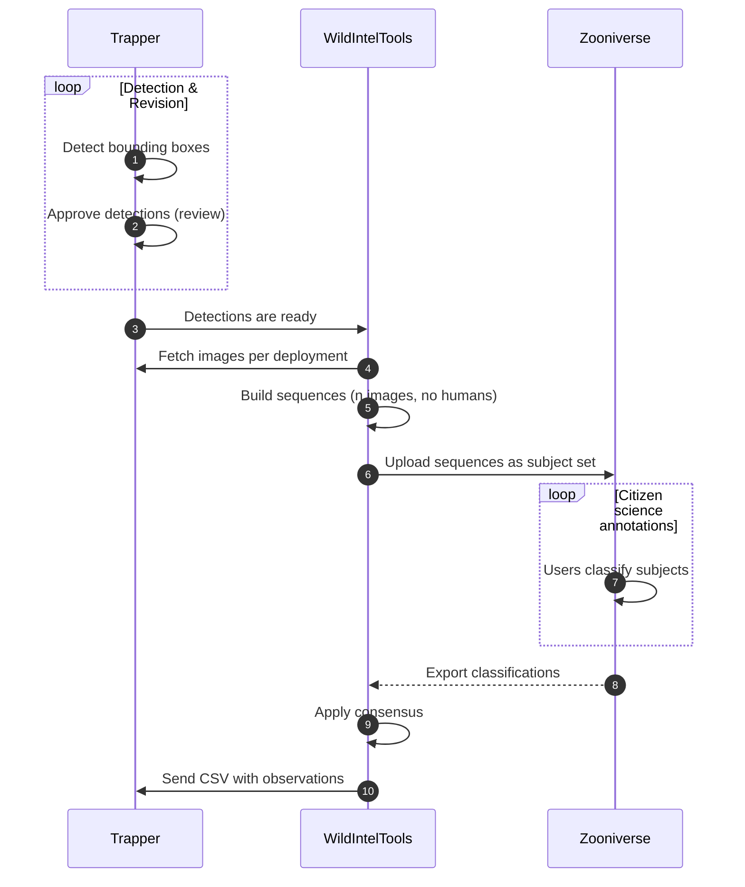
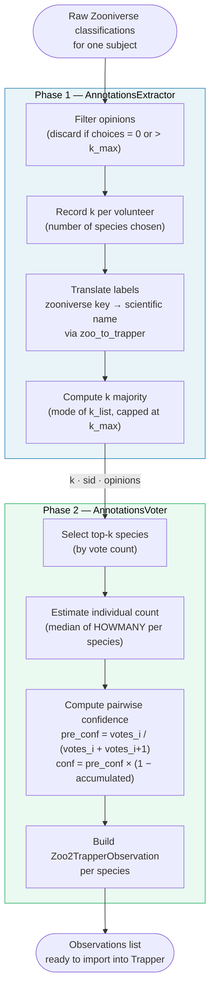

# zooniverse module

Automates the workflow between a [Trapper](https://trapper-project.org) instance and [Zooniverse](https://www.zooniverse.org/), covering two main stages:

1. **Upload** — images with bounding boxes detected and approved in Trapper are loaded into Zooniverse subject sets for citizen-science classification.
2. **Import annotations** — classifications collected in Zooniverse are exported back to Trapper as observations, following a configurable consensus process.

To support this workflow, a set of auxiliary commands is provided for querying and inspecting Zooniverse resources such as subjects, subject sets, workflows, and exported classification data.



---

## Quick start

The workflow starts in Trapper, where an AI model is used to detect animals (bounding boxes) in a collection of images. 
Once those detections are approved, the images are uploaded to Zooniverse for citizen-science classification. 
The resulting annotations are then imported back into Trapper as observations.

### Step 0 — Configuration

Before running any command, the connection to both Trapper and Zooniverse must be configured. The easiest way to do this 
is through the interactive setup wizard:

```console
$ uv run wildintel-tools zooniverse wizard setup

━━━━━━━━━━━━━━━━━━━━━━━━━━━━━━━━━━━━━━━━━━━━━━━━━━━━━━━━━━━━━━━━━━━
  Configure zooniverse module
━━━━━━━━━━━━━━━━━━━━━━━━━━━━━━━━━━━━━━━━━━━━━━━━━━━━━━━━━━━━━━━━━━━

ℹ This wizard will guide you through Zooniverse connection settings. 

Continue? [y/N]: 
```

The wizard will guide you through the following questions:

- **Zooniverse username and password** — credentials for your Zooniverse account.
- **Zooniverse project ID** — numeric ID of the Zooniverse project where subjects will be uploaded. You can find it in the URL of your project's lab page: `https://www.zooniverse.org/lab/{project_id}`.
- **Number of images per sequence** — how many images are sampled from each burst and uploaded as a single subject to Zooniverse. A burst (sequence) is a group of consecutive photos taken within the maximum interval. Default: `5`.
- **Maximum interval between images in a sequence (seconds)** — maximum gap in seconds between two consecutive photos for them to be considered part of the same sequence. If the gap exceeds this value, a new sequence starts. Default: `90`.
- **Maximum upload attempts per sequence** — number of times the upload of a sequence is retried if a transient error occurs (e.g. network timeout). Default: `5`.
- **Delay between sequence upload attempts (seconds)** — seconds to wait before retrying a failed sequence upload. Default: `15`.
- **Maximum attempts per subject** — number of times the upload of a single subject (image) to Zooniverse is retried after a failure. Default: `5`.
- **Delay per subject retry (seconds)** — seconds to wait before retrying the upload of a single subject. Combined with the per-subject attempt limit, this controls the backoff for quota or connectivity errors at subject level. Default: `30`.

Once the wizard completes, verify that the connection details are correct by running:

```bash
$ wildintel-tools zooniverse test-connection
ℹ Testing Zooniverse API connection XXXXX@.uhu.es...
✅ Zooniverse API connection successful!
```

A successful response confirms that wildintel-tools can authenticate against Zooniverse and is ready to use.

### Step 1 — Run AI detection in Trapper

As a general rule, images containing humans or vehicles are **not** uploaded to Zooniverse. To determine whether an 
image contains such content, an AI detector must first be run in Tapper: it calculates bounding boxes and labels each
image with  the type of content detected (animal, human, vehicle). Only images labelled as animals — or with no 
detections — are eligible for upload. This detection process is carried out as follows:


1. In your Trapper instance, go to **Classification → Classification Projects** and click the magnifier icon on the 
classification project you want to use.

    <p align="center">
      
    </p>

2. Click **Classification Results**.

    <p align="center">
      
    </p>
   
3. In the form that appears, fill in the **Collections** field with the names of the collections whose images you want to process, then click **Filter**.

    <p align="center">
      
    </p>
   
4. Click **Select filtered** to mark all images.

    <p align="center">
      
    </p>

5. Under **Actions**, click **More** and select **Classify AI**. Choose the AI model to run.

    <p align="center">
      
    </p>

6. After the detection job finishes (duration depends on the number of images), return to the **Classification Results**
page and select **AI Classifications**.

    <p align="center">
      
    </p>
   
7. Filter by collection, deployment, and/or AI provider, then click **Filter**. The detection results from the previous 
step (step 5) should appear.

    <p align="center">
      
    </p>
   
8. Click **Select filtered**, then under **Actions → More** click **Approve selected**.

    <p align="center">
      
    </p>
   
9. In the confirmation form, enable the following options: **Mark as approved**, **Overwrite attributes**, **Copy bounding boxes**, **Observation type**.

   <p align="center">
      
    </p>

!!! info 
    At this point the images are approved in Trapper with their bounding boxes and are ready to be uploaded to Zooniverse.

### Step 2 — Upload images to Zooniverse

There are two ways to upload images to Zooniverse: using the **interactive wizard** (recommended for first-time users)
or running the **`import` command manually** (recommended for advanced users or automation).

#### Option A — Wizard (recommended)

The wizard guides you step by step through the entire import process, asking you to select the collection, subject set,
deployments, and other options interactively. No prior knowledge of the command-line options is required.

```console
$ uv run wildintel-tools zooniverse wizard import

━━━━━━━━━━━━━━━━━━━━━━━━━━━━━━━━━━━━━━━━━━━━━━━━━━━━━━━━━━━━━━━━━━━
  Import a Trapper collection to Zooniverse
━━━━━━━━━━━━━━━━━━━━━━━━━━━━━━━━━━━━━━━━━━━━━━━━━━━━━━━━━━━━━━━━━━━

ℹ This wizard will guide you through uploading images from a Trapper
  collection to a Zooniverse subject set.

Continue? [y/N]:
```

The wizard will guide you through the following steps:

1. **Select the Trapper collection** — choose the collection whose images you want to upload.
2. **Select or create a subject set** — choose an existing Zooniverse subject set or create a new one with a custom name.
3. **Select the classification project** — if the collection is linked to more than one classification project, you will be prompted to pick one.
4. **Filter by deployments** *(optional)* — narrow the upload to specific deployments within the collection.
5. **Review and confirm** — a summary of all selected options is shown before the upload starts.

Once confirmed, the wizard launches the import and displays a live progress bar. After completion it prints a summary 
report. The full report details can be accessed at any time by running:

```bash
$ wildintel-tools reports view
```

#### Option B — Manual (`import` command)

To upload images use the `wildintel-tools zooniverse import` command. This command requires the Trapper collection
ID you want to upload. 

!!! example "Import collection with ID 123 to Zooniverse"
    ```console
    $ wildintel-tools zooniverse import 123   
    ```
After execution, the application reports the process status and concludes by presenting a summary of the generated results.
The full report details can be accessed by running

```bash
$ wildintel-tools reports view   
```

By default, the command creates a new subject set in Zooniverse with an auto-generated name. To specify a custom name or 
reuse an existing subject set, pass the `SUBJECTSET_NAME` argument. 

!!! example "Import collection with ID 123 to a subject set named 'My subject set name'"
    ```console
    wildintel-tools zooniverse import 123 "My subject set name"
    ```

!!! tip 
    You can query for existing subject sets using the `wildintel-tools zooniverse ss` command and check their IDs and 
    names before running the import. 

In some cases, a single collection could be linked to multiple classification projects. You can specify the classification 
project to use with the `--cp` option. This is required to correctly resolve the media metadata and link the uploaded 
subjects to the right project in Trapper.

!!! example "Import collection with ID 123 to a subject set named 'My subject set name' using classification project with ID 123"
    ```bash
    wildintel-tools zooniverse import 123 "My subject set name" --cp 123
    ```

If a collection contains many images, you can filter them by deployment using the `--deployments` option. Thus only 
images from the specified deployments will be uploaded to Zooniverse. This option accepts a comma- or space-separated 
list of deployment IDs to include in the upload. 

!!! example "Import collection with ID 123 to a subject set named 'My subject set name' using only deployments with IDs 123 and 456"
    ```bash
    wildintel-tools zooniverse import 123 --deployments 123,456
    ``` 

Also, if you want to exclude some deployments, use the `--exclude-deployments` option. This option accepts a comma- or
space-separated list of deployment IDs to exclude from the upload.

!!! example "Import collection with ID 123 to a subject set named 'My subject set name' excluding deployments with IDs 789 and 101"
    ```console
    wildintel zooniverse import 123 "My subject set name" --deployments 123,456 --exclude-deployments 789,101
    ``` 

If this command was interrupted or some images were already uploaded in a previous run, you can pass a [Zooniverse subjects
export file](https://help.zooniverse.org/next-steps/data-exports/) to skip those images and avoid duplicates using
the `--exclude-subjects` option.

!!! example "Import collection with ID 123, excluding deployments 789 and 101, and skipping already uploaded subjects listed in subjects_export.tsv"
    ```bash
    wildintel-tools zooniverse import 123 --exclude-deployments 789,101 --exclude-subjects subjects_export.tsv
    ```

!!! tip
    You can download the subjects export file from **https://www.zooniverse.org/lab/{project_id}/data-exports** under 
    **Request new subject export**. Use the [`uploaded-media`](#uploaded-media) command to inspect the file and verify which
    media IDs have already been uploaded before running `import`.

### Step 3 — Validate the subject set

Before making the subject set live for classification, verify that the upload completed correctly. The tools below all
work from a **Zooniverse subjects export file** — download it from
`https://www.zooniverse.org/lab/{project_id}/data-exports` → **Request new subject export**.

Four dedicated commands cover different aspects of the validation. Use them individually for targeted checks or run
`check-subject-set` to perform all of them at once.

---

#### Full check — `check-subject-set`

Runs all four validations in a single pass and prints a consolidated report:

- **Missing media** — media Trapper expected to upload but absent from the CSV.
- **Extra media** — subjects present in the CSV that Trapper never intended to upload.
- **Duplicated media** — media IDs linked to more than one subject (uploaded more than once).
- **Unmatched subjects** — subjects whose metadata contains no extractable Trapper media ID.
- **Metadata issues** — subjects whose metadata fields are incomplete or incorrect.

!!! example "Full validation of collection 66 against a subjects export"
    ```console
    $ wildintel-tools zooniverse check-subject-set european-camera-trap-project-subjects.csv 66 \
        --rp 12 --cp 34 --ss 9876
    ```

The summary line at the end shows all counters at a glance:

```
Summary: 1420 expected · 1418 uploaded · 2 missing · 0 extra · 0 duplicated · 1 unmatched · 0 metadata issues
```

---

#### Check missing media — `check-missing-media`

Follows the same media-selection logic as `import` (deployments, sequences, public-only, human-filtered) and reports
every media ID that Trapper expects in the subject set but is absent from the CSV. Requires a Trapper connection.

!!! example "Check for missing media in collection 66"
    ```console
    $ wildintel-tools zooniverse check-missing-media european-camera-trap-project-subjects.csv 66 \
        --rp 12 --cp 34
    ```

Use `--pipeline` to get only the missing media IDs as plain output, one per line, suitable for shell pipelines:

```console
$ wildintel-tools zooniverse check-missing-media subjects.csv 66 --rp 12 --cp 34 --pipeline
```

---

#### Check duplicated media — `check-duplicated-media`

Scans the CSV and reports every media ID that appears linked to more than one subject ID. This indicates the same
Trapper media was uploaded multiple times, which can skew classification results.

!!! example "Check for duplicated media IDs"
    ```console
    $ wildintel-tools zooniverse check-duplicated-media european-camera-trap-project-subjects.csv
    ```

Filter to a specific subject set with `--ss`:

```console
$ wildintel-tools zooniverse check-duplicated-media subjects.csv --ss 9876
```

---

#### Check unmatched subjects — `check-unmatched-subjects`

Scans the CSV and lists every subject ID from which no Trapper `media_id` can be extracted. This usually indicates
missing or malformed `origin` / `external_id` metadata fields.

!!! example "Check for subjects with no media ID"
    ```console
    $ wildintel-tools zooniverse check-unmatched-subjects european-camera-trap-project-subjects.csv
    ```

---

#### Check metadata only — `check-metadata`

Validates that every subject in the CSV has all required metadata fields (`external_id`, `preview`, `link`,
`thumbnail`, `origin`, `license`, `image_name`) and that a Trapper media ID can be extracted from them.
Does **not** require a Trapper connection.

!!! example "Check metadata for all subjects"
    ```console
    $ wildintel-tools zooniverse check-metadata european-camera-trap-project-subjects.csv
    ```

Use `--all` to display every subject (not just those with issues), or `--pipeline` to output only the
`subject_id`s with problems for use in scripts:

```console
$ wildintel-tools zooniverse check-metadata subjects.csv --ss 9876 --pipeline | xargs ...
```

### Step 4 — Import annotations back to Trapper

Once all the subjects in a subject set linked to a Zooniverse workflow have been classified, the annotations can be
imported back into Trapper. As with the upload step, there are two ways to do this: using the **interactive wizard**
(recommended for first-time users) or running the **`export` command manually** (recommended for advanced users or
automation).

#### Option A — Wizard (recommended)

The wizard guides you step by step through the entire export process, asking you to select the subject set, workflow,
collection, and classification project interactively. No prior knowledge of the command-line options is required.

```console
$ wildintel-tools zooniverse wizard export

━━━━━━━━━━━━━━━━━━━━━━━━━━━━━━━━━━━━━━━━━━━━━━━━━━━━━━━━━━━━━━━━━━━
  Export annotations from a Zooniverse subject set to Trapper
━━━━━━━━━━━━━━━━━━━━━━━━━━━━━━━━━━━━━━━━━━━━━━━━━━━━━━━━━━━━━━━━━━━

ℹ This wizard will guide you through exporting Zooniverse classification
  results back to Trapper as observations. You will need to select
  the subject set, the research project and the classification project.

Continue? [y/N]:
```

The wizard will guide you through the following steps:

1. **Select the Zooniverse subject set** — choose the subject set whose classifications you want to export.
2. **Select the Zooniverse workflow** — choose the workflow in which volunteers performed the classifications.
3. **Select the Trapper collection** — choose the destination collection in Trapper.
4. **Select the classification project** — choose the Trapper classification project linked to that collection.
5. **Filter by deployments** *(optional)* — restrict the export to specific deployments.
6. **Review and confirm** — a summary of all selected options is shown before the export starts.

Once confirmed, the wizard applies the consensus process and generates a CSV file with observations ready to be
imported into Trapper. It prints the path of the generated CSV and the Trapper import URL.

!!! warning "Important"
    The CSV import into Trapper must be performed while logged in as the Zooniverse user configured in
    `ZOONIVERSE.zooniverse_username`. Using a different account will cause the import to fail or produce incorrect results.

#### Option B — Manual (`export` command)

Once all the subjects in a subject set linked to a Zooniverse workflow have been classified, use the `export` command.
You must specify the subject set whose labels you want to import (using the `--ss` option) and the workflow where the
labels were generated (using the `--wf` option). You also need to define the destination collection (`--c`) and the
classification project (`--cp`).

The command applies a consensus process to the classifications collected in Zooniverse and generates a CSV file with
observations that can be imported into Trapper. It also prints the path of the generated observations CSV and the URL
to import it into Trapper.

!!! example "Export classifications from Zooniverse workflow with ID 123 and subject set with ID 456 to Trapper collection with ID 789 and classification project with ID 101"
    ```bash
    wildintel-tools zooniverse export \
      --cp 101 \
      --c 789 \
      --ss 456 \
      --wf 123
    ```

By default, the command processes all deployments linked to the specified collection. To restrict the export to specific
deployments, use the `--deployments` option:

!!! example "Same export using only deployments with IDs 123 and 456"
    ```bash
    wildintel-tools zooniverse export \
      --cp 101 \
      --c 789 \
      --ss 456 \
      --wf 123 \
      --d 123,456
    ```

By default, the command saves the generated observations CSV in a temporary directory. To specify a custom path, use the
`--observations-file` option:

!!! example "Same export saving the observations CSV to /path/to/observations.csv"
    ```bash
    wildintel-tools zooniverse export \
      --cp 101 \
      --c 789 \
      --ss 456 \
      --wf 123 \
      --d 123,456 \
      --of /path/to/observations.csv
    ```

Since the raw Zooniverse annotations are often useful for debugging and analysis, they can be saved as a separate CSV
file by enabling the `--save-zoo-annotations` flag:

!!! example "Same export also saving the raw Zooniverse annotations to a separate CSV"
    ```bash
    wildintel-tools zooniverse export \
      --cp 101 \
      --c 789 \
      --ss 456 \
      --wf 123 \
      --d 123,456 \
      --of /path/to/observations.csv \
      --save-zoo-annotations
    ```

!!! warning "Important"
    The CSV import into Trapper must be performed while logged in as the Zooniverse user configured in
    `ZOONIVERSE.zooniverse_username`. Using a different account will cause the import to fail or produce incorrect results.

## Consensus process

Once Zooniverse volunteers have finished classifying a subject set, the raw output is a collection of individual
opinions — one per volunteer per subject. Before those opinions can be imported into Trapper as observations, they
must be reconciled into a single authoritative answer per image. This reconciliation is called the **consensus
process**.

The consensus process answers three questions for each subject:

1. **How many distinct species appear in this image?**
2. **Which species are they?**
3. **How many individuals of each species are visible?**

Each of these questions is answered by aggregating the volunteers' votes, not by selecting one individual's answer.
The process is designed to be robust to outliers (e.g., a volunteer who labels an image with an unrealistic number
of species) while still capturing the community's collective knowledge.

### Default consensus implementation

The default implementation is split across two classes:

| Class | Responsibility |
|---|---|
| `AnnotationsExtractor` (+ workflow subclass) | Phase 1 — filter opinions, translate labels, determine *k* |
| `AnnotationsVoter` (+ workflow subclass) | Phase 2 — vote on species and count, compute confidence |

#### Phase 1 — Extraction (`AnnotationsExtractor`)

The extractor processes the raw Zooniverse classifications for a single subject. Its goal is to produce a clean,
normalised list of `(species, attributes)` pairs — one entry per volunteer choice — together with the **consensus
number of species** *k* for that image.

Steps:

1. **Filter invalid opinions.** Any volunteer classification that contains zero species choices or more than
   `k_max` choices (default `3`) is discarded. This removes accidental submissions and implausible outliers.

2. **Record *k* per volunteer.** For each surviving classification the number of species the volunteer labelled
   is stored in a list `k_list`.

3. **Translate Zooniverse labels to Trapper names.** Each Zooniverse choice string (e.g. `REDDEER`) is mapped to
   a scientific name or category (e.g. `Cervus elaphus`) via the workflow-specific `zoo_to_trapper` dictionary
   defined in the subclass (e.g. `Workflow29187AnnotationExtractor`).

4. **Compute *k* majority.** The consensus number of species *k* is the most frequent value in `k_list`, capped
   at `k_max`. When there is a tie, the largest tied value is used.

The output passed to Phase 2 is a tuple `(k, subject_id, opinions)`, where `opinions` is the full list of
`(species_name, {HOWMANY: N, …})` pairs contributed by all valid volunteers.

#### Phase 2 — Voting (`Workflow29187AnnotationsVoter`)

The voter takes the normalised opinions from Phase 1 and produces one `Zoo2TrapperObservation` per species.

Steps:

1. **Select the top-*k* species.** Votes are counted per species. The *k* most-voted species are selected. When
   *k* > 1 the generic label `NOANIMAL` is excluded from competition (a volunteer who said "no animal" alongside
   a species choice is treated as having voted for the species only).

2. **Estimate individual count.** For each of the top-*k* species, the individual counts (`HOWMANY`) reported by
   all volunteers are collected and their **median** (rounded up) is used as the consensus count.

3. **Compute pairwise confidence.** Confidence is assigned to each species in rank order:

    - The **pre-confidence** of species *i* is the ratio of its votes to the combined votes of species *i* and *i+1*:
      `pre_conf = votes_i / (votes_i + votes_{i+1})`. For the last species, `pre_conf = 1.0`.
    - The **allocated confidence** is `pre_conf × (1 − accumulated_confidence)`, so that the total confidence
      across all species in an image sums to 1.

4. **Build the observation.** For each species a `Zoo2TrapperObservation` is created with the consensus count,
   the two confidence values, and the appropriate `observationType` (e.g. `animal`, `blank`, `human`).

### Process diagram



---

## Reference


### test-connection

Test the connection to the Zooniverse API using the credentials in the active project settings.

```bash
wildintel zooniverse test-connection [OPTIONS]
```

Alias: `tc`

| Option | Type | Default | Description |
|---|---|---|---|
| `--zooniverse-username TEXT` | str | settings | Zooniverse username |
| `--zooniverse-password TEXT` | str | settings | Zooniverse password |
| `--zooniverse-project-id TEXT` | str | settings | Zooniverse project ID |

---

### workflows

Retrieve and display workflows from the Zooniverse project.

```bash
wildintel zooniverse workflows [WF_ID] [OPTIONS]
```

Alias: `wf`

| Argument / Option | Type | Default | Description |
|---|---|---|---|
| `WF_ID` | str | all | Workflow ID(s) to retrieve (comma/space separated). Use `-` to read from stdin |
| `--pipeline` | flag | off | Print only workflow IDs as a comma-separated list (for shell pipelines) |
| `--query-param TEXT` | list | `None` | Extra query parameters in `key=value` format. Repeatable. |
| `--raw` | flag | off | Display raw JSON output instead of a formatted table |

---

### subjectsets

Retrieve subject sets from the Zooniverse project.

```bash
wildintel zooniverse subjectsets [SS_ID] [OPTIONS]
```

Alias: `ss`

| Argument / Option | Type | Default | Description |
|---|---|---|---|
| `SS_ID` | str | all | Subject set ID(s) (comma/space separated). Use `-` to read from stdin |
| `--pipeline` | flag | off | Print only subject set IDs as a comma-separated list |
| `--query-param TEXT` | list | `None` | Extra query parameters in `key=value` format. Repeatable. |
| `--exports` | flag | off | Only return subject sets that have exports |
| `--wf-id` | int | `None` | Filter to subject sets linked to this workflow ID |
| `--raw` | flag | off | Display each subject set as formatted JSON |

---

### subjects

Retrieve individual subjects (images) from Zooniverse.

```bash
wildintel zooniverse subjects [ID] [OPTIONS]
```

Alias: `sbj`

| Argument / Option | Type | Default | Description |
|---|---|---|---|
| `ID` | str | `None` | Subject ID(s) (comma/space separated). Use `-` to read from stdin. Mutually exclusive with `--subjectset-id`. |
| `--subjectset-id, --ss-id` | int | `None` | Retrieve all subjects from this subject set |
| `--pipeline` | flag | off | Print only subject IDs as a comma-separated list |
| `--query-param TEXT` | list | `None` | Extra query parameters in `key=value` format. Repeatable. |
| `--raw` | flag | off | Show raw JSON for a single subject |

---

### update-metadata

Update the metadata of all subjects in a Zooniverse subject set using data retrieved from Trapper. The command extracts the `media_id` from each subject filename, queries Trapper for the corresponding media in the selected classification project, and updates the subject metadata accordingly.

```bash
wildintel zooniverse update-metadata SS_ID [OPTIONS]
```

Alias: `um`

| Argument / Option | Type | Default | Description |
|---|---|---|---|
| `SS_ID` | int | required | Subject set ID to update |
| `--cp` | int | required | Trapper classification project ID |
| `--dry-run` | flag | off | Simulate the process — metadata is resolved but no subject is updated in Zooniverse |
| `--attempts` | int | `3` | Maximum retry attempts per subject |
| `--delay-seconds` | int | `5` | Seconds to wait between retries |
| `--white-list TEXT` | str | `None` | Comma/space separated list of subject IDs to process exclusively |
| `--black-list TEXT` | str | `None` | Comma/space separated list of subject IDs to skip |

---

### import

Upload all media (images) from a Trapper collection to a Zooniverse subject set. Images are grouped into sequences according to the `--n-images-seq` and `--max-interval` parameters.

```bash
wildintel zooniverse import COLLECTION [SUBJECTSET_NAME] [OPTIONS]
```

| Argument / Option | Type | Default | Description |
|---|---|---|---|
| `COLLECTION` | int | required | Trapper collection ID |
| `SUBJECTSET_NAME` | str | auto-generated | Name of the Zooniverse subject set to create or reuse |
| `--rp` | int | `None` | Trapper research project ID |
| `--cp` | int | `None` | Trapper classification project ID |
| `--deployments, -d TEXT` | str | all | Deployment IDs to include (comma/space separated). Use `-` to read from stdin. |
| `--exclude-deployments, -x TEXT` | str | `None` | Deployment IDs to exclude |
| `--n-images-seq` | int | settings | Number of images per sequence |
| `--max-interval` | int | settings | Maximum interval (seconds) between images in the same sequence |
| `--dry-run` | flag | off | Simulate the process — no images downloaded, no subject set created, nothing uploaded |

---

### export

Export the classification results of a Zooniverse subject set back to Trapper as observations.

```bash
wildintel zooniverse export [OPTIONS]
```

Alias: `exp`

| Option | Type | Default | Description |
|---|---|---|---|
| `--wf, --workflow` | int | required | Zooniverse workflow ID |
| `--ss, --subject-set` | int | required | Zooniverse subject set ID |
| `--cp, --classification-project` | int | required | Trapper classification project ID |
| `--collection, --c` | int | required | Trapper collection ID |
| `--deployments, --d` | list[int] | all | Trapper deployment IDs to process |
| `--observations-file, -of PATH` | Path | auto | Path to save the raw observations CSV before upload |
| `--verbose / --no-verbose` | bool | `True` | Show per-media detail in the progress bar |
| `--save-zoo-annotations / --no-save-zoo-annotations` | bool | `True` | Save the raw Zooniverse user opinions as a separate CSV with a `zoo_annotations_` prefix |

After the export completes, the command prints the path of the generated observations CSV and the Trapper import URL. The CSV **must** be imported into Trapper while logged in as the configured Zooniverse user (`ZOONIVERSE.zooniverse_username`).

!!! warning "Important"
    The CSV import into Trapper must be performed while logged in as the Zooniverse user configured in `ZOONIVERSE.zooniverse_username`. Using a different account will cause the import to fail or produce incorrect results.

---

### download-ss

Download subject images from one or more Zooniverse subject sets to a local directory.

```bash
wildintel zooniverse download-ss SS_IDS... [OPTIONS]
```

Alias: `dl_ss`

| Argument / Option | Type | Default | Description |
|---|---|---|---|
| `SS_IDS` | list[int] | required | One or more subject set IDs to download |
| `--output-dir, -o PATH` | Path | temp dir | Directory where downloaded images will be saved |
| `--max-workers` | int | `4` | Number of parallel download threads |
| `--overwrite` | flag | off | Overwrite existing files |
| `--verbose / --no-verbose` | bool | `True` | Show per-subject detail during download |

---

### wizard

Interactive wizard for common Zooniverse workflows.

```bash
wildintel zooniverse wizard WIZARD
```

| Wizard | Description |
|---|---|
| `setup` | Guided configuration of Zooniverse connection settings |
| `import` | Guided step-by-step import of a Trapper collection to Zooniverse |
| `export` | Guided step-by-step export of Zooniverse annotations back to Trapper |
| `download` | Guided download of subject images from a Zooniverse subject set |
| `validate` | Guided validation of a Zooniverse subject set against a Trapper collection |

---

### uploaded-media

Read a Zooniverse subjects export file and list the Trapper media IDs that have already been uploaded. Media IDs are extracted from the `origin` or `external_id` metadata field using the pattern `/:media:<id>`.

```bash
wildintel zooniverse uploaded-media SUBJECTS_CSV [OPTIONS]
```

| Argument / Option | Type | Default | Description |
|---|---|---|---|
| `SUBJECTS_CSV` | Path | required | Path to the Zooniverse subjects export CSV/TSV file |
| `--subject-set-id, --ss-id` | int | `None` | Filter by subject set ID. If omitted, all rows are included |
| `--pipeline` | flag | off | Output only media IDs separated by newlines (for shell pipelines) |
| `--unresolved` | flag | off | Show only subjects for which no media_id could be extracted |
| `--only-duplicated` | flag | off | Show only media_ids that appear more than once |

---

### validate-subject-set

Validate a Zooniverse subject set against a Trapper collection using the same media-selection logic as `import`. Reports missing media (expected but absent from the subject set), extra media (uploaded but not expected), and subjects with incorrect metadata.

```bash
wildintel zooniverse validate-subject-set SUBJECTS_CSV COLLECTION [OPTIONS]
```

| Argument / Option | Type | Default | Description |
|---|---|---|---|
| `SUBJECTS_CSV` | Path | required | Path to the Zooniverse subjects export CSV/TSV file |
| `COLLECTION` | int | required | Trapper collection ID |
| `--rp, --research-project` | int | `None` | ID of the research project |
| `--cp, --classification-project` | int | required | ID of the classification project linked to the collection |
| `--subject-set-id, --ss-id` | int | `None` | Filter the CSV by subject set ID. If omitted, all rows are included |
| `--deployments, --d TEXT` | str | auto | Deployment IDs to include (comma/space separated) |
| `--exclude-deployments, --ed TEXT` | str | `None` | Deployment IDs to skip |
| `--n-images-seq` | int | `5` | Number of images per sequence |
| `--max-interval` | int | `90` | Maximum interval between images in a sequence (seconds) |

---

### check-metadata

Validate the metadata fields of every subject in a Zooniverse subjects export file. Checks that required fields (`external_id`, `preview`, `link`, `thumbnail`, `origin`, `license`, `image_name`) are present and that a Trapper media_id can be resolved.

```bash
wildintel zooniverse check-metadata SUBJECTS_CSV [OPTIONS]
```

| Argument / Option | Type | Default | Description |
|---|---|---|---|
| `SUBJECTS_CSV` | Path | required | Path to the Zooniverse subjects export CSV/TSV file |
| `--subject-set-id, --ss-id` | int | `None` | Filter by subject set ID. If omitted, all rows are included |
| `--all` | flag | off | Show all subjects, not only those with issues |
| `--pipeline` | flag | off | Output only subject_ids with issues separated by newlines (for shell pipelines) |
