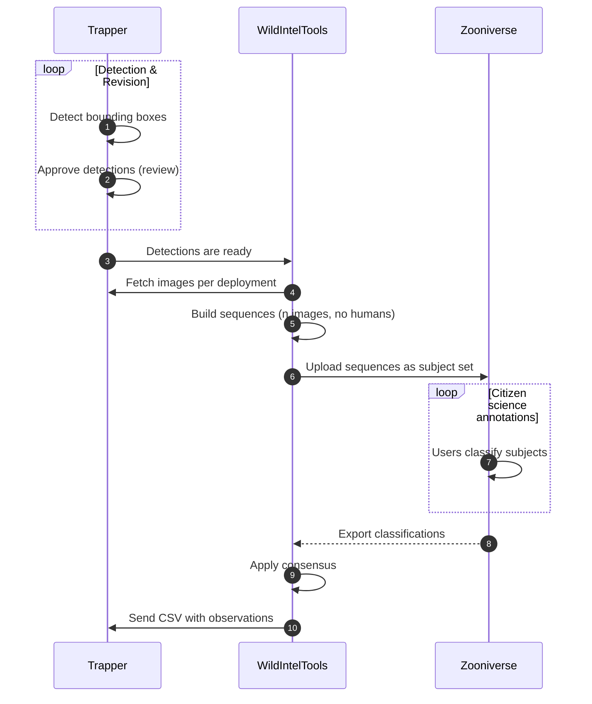

# zooniverse module

Automates the workflow between a [Trapper](https://trapper-project.org) instance and [Zooniverse](https://www.zooniverse.org/), covering two main stages:

1. **Upload** — images with bounding boxes detected and approved in Trapper are loaded into Zooniverse subject sets for citizen-science classification.
2. **Import annotations** — classifications collected in Zooniverse are exported back to Trapper as observations, following a configurable consensus process.

To support this workflow, a set of auxiliary commands is provided for querying and inspecting Zooniverse resources such as subjects, subject sets, workflows, and exported classification data.


---

## Quick start

The workflow starts in Trapper, where an AI model is used to detect animals (bounding boxes) in a collection of images. 
Once those detections are approved, the images are uploaded to Zooniverse for citizen-science classification. 
The resulting annotations are then imported back into Trapper as observations.

### Step 0 — Configuration

Before running any command, the connection to both Trapper and Zooniverse must be configured. The easiest way to do this 
is through the interactive setup wizard:

```console
$ wildintel-tools zooniverse wizard setup
```

The wizard will guide you through the following questions:

- **Zooniverse username and password** — credentials for your Zooniverse account.
- **Zooniverse project ID** — numeric ID of the Zooniverse project where subjects will be uploaded. You can find it in the URL of your project's lab page: `https://www.zooniverse.org/lab/{project_id}`.
- **Number of images per sequence** — how many images are sampled from each burst and uploaded as a single subject to Zooniverse. A burst (sequence) is a group of consecutive photos taken within the maximum interval. Default: `5`.
- **Maximum interval between images in a sequence (seconds)** — maximum gap in seconds between two consecutive photos for them to be considered part of the same sequence. If the gap exceeds this value, a new sequence starts. Default: `90`.
- **Maximum upload attempts per sequence** — number of times the upload of a sequence is retried if a transient error occurs (e.g. network timeout). Default: `5`.
- **Delay between sequence upload attempts (seconds)** — seconds to wait before retrying a failed sequence upload. Default: `15`.
- **Maximum attempts per subject** — number of times the upload of a single subject (image) to Zooniverse is retried after a failure. Default: `5`.
- **Delay per subject retry (seconds)** — seconds to wait before retrying the upload of a single subject. Combined with the per-subject attempt limit, this controls the backoff for quota or connectivity errors at subject level. Default: `30`.

Once the wizard completes, verify that the connection details are correct by running:

```bash
wildintel zooniverse test-connection
```

A successful response confirms that wildintel-tools can authenticate against Zooniverse and is ready to use.

### Step 1 — Run AI detection in Trapper

As a general rule, images containing humans or vehicles are **not** uploaded to Zooniverse. To determine whether an 
image contains such content, an AI detector must first be run in Tapper: it calculates bounding boxes and labels each
image with  the type of content detected (animal, human, vehicle). Only images labelled as animals — or with no 
detections — are eligible for upload. This detection process is carried out as follows:


1. In your Trapper instance, go to **Classification → Classification Projects** and click the magnifier icon on the 
classification project you want to use.

    <p align="center">
      
    </p>

2. Click **Classification Results**.

    <p align="center">
      
    </p>
   
3. In the form that appears, fill in the **Collections** field with the names of the collections whose images you want to process, then click **Filter**.

    <p align="center">
      
    </p>
4. Click **Select filtered** to mark all images.

    <p align="center">
      
    </p>

5. Under **Actions**, click **More** and select **Classify AI**. Choose the AI model to run.

    <p align="center">
      
    </p>

6. After the detection job finishes (duration depends on the number of images), return to the **Classification Results**
page and select **AI Classifications**.

    <p align="center">
      
    </p>
   
7. Filter by collection, deployment, and/or AI provider, then click **Filter**. The detection results from the previous 
step (step 5) should appear.

    <p align="center">
      
    </p>
   
8. Click **Select filtered**, then under **Actions → More** click **Approve selected**.

    <p align="center">
      
    </p>
   
9. In the confirmation form, enable the following options: **Mark as approved**, **Overwrite attributes**, **Copy bounding boxes**, **Observation type**.

   <p align="center">
      
    </p>

!!! info 
    At this point the images are approved in Trapper with their bounding boxes and are ready to be uploaded to Zooniverse.

### Step 2 — Upload images to Zooniverse

To upload images use the `wildintel-tools zooniverse importation` command. This command requires the Trapper collection
ID you want to upload. 

!!! example "Import collection with ID 123 to Zooniverse"
    ```console
    $ wildintel-tools zooniverse importation 123   
    ```
After execution, the application reports the process status and concludes by presenting a summary of the generated results.
The full report details can be accessed by running

```bash
$ wildintel-tools zooniverse reports view   
```

By default, the command creates a new subject set in Zooniverse with an auto-generated name. To specify a custom name or 
reuse an existing subject set, pass the `SUBJECTSET_NAME` argument. 


!!! example "Import collection with ID 123 to a subject set named 'My subject set name'"
    ```console
    wildintel-tools zooniverse importation 123 "My subject set name"
    ```

In some cases, a single collection could be linked to multiple classification projects. You can specify the classification 
project to use with the `--cp` option. For example, to use the classification project with ID `123`:

!!! example "Import collection with ID 123 to a subject set named 'My subject set name' using classification project with ID 123"
    ```bash
    wildintel-tools zooniverse importation 123 "My subject set name" --cp 123
    ```

If a collection contains many images, you can filter them by deployment using the `--deployments` option:

!!! example "Import collection with ID 123 to a subject set named 'My subject set name' using only deployments with IDs 123 and 456"
    ```bash
    wildintel-tools zooniverse importation 123 --deployments 123,456
    ``` 
Also, if you want to exclude some deployments, use the `--exclude-deployments` option:

!!! example "Import collection with ID 123 to a subject set named 'My subject set name' excluding deployments with IDs 789 and 101"
    ```console
    wildintel zooniverse importation 123 "My subject set name" --deployments 123,456 --exclude-deployments 789,101
    ``` 

If this command was interrupted or some images were already uploaded in a previous run, you can pass a Zooniverse subjects
export file to skip those images and avoid duplicates using `--exclude-subjects` option :

!!! example "Import collection with ID 123 to a subject set named 'My subject set name' using only deployments with IDs 123 and 456, excluding deployments with IDs 789 and 101, and skipping already uploaded subjects listed in subjects_export.tsv"
    ```bash
    wildintel-tools zooniverse importation 123 --exclude-deployments 789,101 --subjects-subjects subjects_export.tsv
    ```
!!! tip
    You can download the subjects export file from **https://www.zooniverse.org/lab/{project_id}/data-exports** under 
    **Request new subject export**. Use the [`uploaded-media`](#uploaded-media) command to inspect the file and verify which
    media IDs have already been uploaded before running `importation`.

### Step 3 — Collect classifications in Zooniverse

Once the subject set is live, citizen scientists classify the images through the Zooniverse workflow. When enough 
classifications have been collected, proceed to the next step.

### Step 4 — Import annotations back to Trapper

Use the [`public-annotations`](#public-annotations) command to export the Zooniverse classifications and import them into Trapper as observations:

```bash
wildintel zooniverse public-annotations \
  --cp <classification_project_id> \
  --collection <collection_id> \
  --ss-id <subject_set_id> \
  --wf-id <workflow_id>
```

## Reference


### test-connection

Test the connection to the Zooniverse API using the credentials in the active project settings.

```bash
wildintel zooniverse test-connection [OPTIONS]
```

Alias: `tc`

| Option | Type | Default | Description |
|---|---|---|---|
| `--zooniverse-username TEXT` | str | settings | Zooniverse username |
| `--zooniverse-password TEXT` | str | settings | Zooniverse password |
| `--zooniverse-project-id TEXT` | str | settings | Zooniverse project ID |

---

### workflows

Retrieve and display workflows from the Zooniverse project.

```bash
wildintel zooniverse workflows [WF_ID] [OPTIONS]
```

Alias: `wf`

| Argument / Option | Type | Default | Description |
|---|---|---|---|
| `WF_ID` | str | all | Workflow ID(s) to retrieve (comma/space separated). Use `-` to read from stdin |
| `--pipeline` | flag | off | Print only workflow IDs as a comma-separated list (for shell pipelines) |
| `--query-param TEXT` | list | `None` | Extra query parameters in `key=value` format. Repeatable. |
| `--raw` | flag | off | Display raw JSON output instead of a formatted table |

---

### subjectsets

Retrieve subject sets from the Zooniverse project.

```bash
wildintel zooniverse subjectsets [SS_ID] [OPTIONS]
```

Alias: `ss`

| Argument / Option | Type | Default | Description |
|---|---|---|---|
| `SS_ID` | str | all | Subject set ID(s) (comma/space separated). Use `-` to read from stdin |
| `--pipeline` | flag | off | Print only subject set IDs as a comma-separated list |
| `--query-param TEXT` | list | `None` | Extra query parameters in `key=value` format. Repeatable. |
| `--exports` | flag | off | Only return subject sets that have exports |
| `--wf-id` | int | `None` | Filter to subject sets linked to this workflow ID |
| `--raw` | flag | off | Display each subject set as formatted JSON |

---

### subjects

Retrieve individual subjects (images) from Zooniverse.

```bash
wildintel zooniverse subjects [ID] [OPTIONS]
```

Alias: `sbj`

| Argument / Option | Type | Default | Description |
|---|---|---|---|
| `ID` | str | `None` | Subject ID(s) (comma/space separated). Use `-` to read from stdin. Mutually exclusive with `--subjectset-id`. |
| `--subjectset-id, --ss-id` | int | `None` | Retrieve all subjects from this subject set |
| `--pipeline` | flag | off | Print only subject IDs as a comma-separated list |
| `--query-param TEXT` | list | `None` | Extra query parameters in `key=value` format. Repeatable. |
| `--raw` | flag | off | Show raw JSON for a single subject |

---

### update-metadata

Update the metadata of all subjects in a Zooniverse subject set using data retrieved from Trapper. The command extracts the `media_id` from each subject filename, queries Trapper for the corresponding media in the selected classification project, and updates the subject metadata accordingly.

```bash
wildintel zooniverse update-metadata SS_ID [OPTIONS]
```

Alias: `um`

| Argument / Option | Type | Default | Description |
|---|---|---|---|
| `SS_ID` | int | required | Subject set ID to update |
| `--cp` | int | required | Trapper classification project ID |
| `--dry-run` | flag | off | Simulate the process — metadata is resolved but no subject is updated in Zooniverse |
| `--attempts` | int | `3` | Maximum retry attempts per subject |
| `--delay-seconds` | int | `5` | Seconds to wait between retries |
| `--white-list TEXT` | str | `None` | Comma/space separated list of subject IDs to process exclusively |
| `--black-list TEXT` | str | `None` | Comma/space separated list of subject IDs to skip |

---

### import

Upload all media (images) from a Trapper collection to a Zooniverse subject set. Images are grouped into sequences according to the `--n-images-seq` and `--max-interval` parameters.

```bash
wildintel zooniverse import COLLECTION [SUBJECTSET_NAME] [OPTIONS]
```

| Argument / Option | Type | Default | Description |
|---|---|---|---|
| `COLLECTION` | int | required | Trapper collection ID |
| `SUBJECTSET_NAME` | str | auto-generated | Name of the Zooniverse subject set to create or reuse |
| `--rp` | int | `None` | Trapper research project ID |
| `--cp` | int | `None` | Trapper classification project ID |
| `--deployments, -d TEXT` | str | all | Deployment IDs to include (comma/space separated). Use `-` to read from stdin. |
| `--exclude-deployments, -x TEXT` | str | `None` | Deployment IDs to exclude |
| `--n-images-seq` | int | settings | Number of images per sequence |
| `--max-interval` | int | settings | Maximum interval (seconds) between images in the same sequence |
| `--dry-run` | flag | off | Simulate the process — no images downloaded, no subject set created, nothing uploaded |

---

### export

Export the classification results of a Zooniverse subject set back to Trapper as observations.

```bash
wildintel zooniverse export [OPTIONS]
```

Alias: `exp`

| Option | Type | Default | Description |
|---|---|---|---|
| `--wf, --workflow` | int | required | Zooniverse workflow ID |
| `--ss, --subject-set` | int | required | Zooniverse subject set ID |
| `--cp, --classification-project` | int | required | Trapper classification project ID |
| `--collection, --c` | int | required | Trapper collection ID |
| `--deployments, --d` | list[int] | all | Trapper deployment IDs to process |
| `--observations-file, -of PATH` | Path | auto | Path to save the raw observations CSV before upload |
| `--verbose / --no-verbose` | bool | `True` | Show per-media detail in the progress bar |
| `--save-zoo-annotations / --no-save-zoo-annotations` | bool | `True` | Save the raw Zooniverse user opinions as a separate CSV with a `zoo_annotations_` prefix |

After the export completes, the command prints the path of the generated observations CSV and the Trapper import URL. The CSV **must** be imported into Trapper while logged in as the configured Zooniverse user (`ZOONIVERSE.zooniverse_username`).

!!! warning "Important"
    The CSV import into Trapper must be performed while logged in as the Zooniverse user configured in `ZOONIVERSE.zooniverse_username`. Using a different account will cause the import to fail or produce incorrect results.

---

### download-ss

Download subject images from one or more Zooniverse subject sets to a local directory.

```bash
wildintel zooniverse download-ss SS_IDS... [OPTIONS]
```

Alias: `dl_ss`

| Argument / Option | Type | Default | Description |
|---|---|---|---|
| `SS_IDS` | list[int] | required | One or more subject set IDs to download |
| `--output-dir, -o PATH` | Path | temp dir | Directory where downloaded images will be saved |
| `--max-workers` | int | `4` | Number of parallel download threads |
| `--overwrite` | flag | off | Overwrite existing files |
| `--verbose / --no-verbose` | bool | `True` | Show per-subject detail during download |

---

### wizard

Interactive wizard for common Zooniverse workflows.

```bash
wildintel zooniverse wizard WIZARD
```

| Wizard | Description |
|---|---|
| `import` | Guided step-by-step import of a Trapper collection to Zooniverse |
| `export` | Guided step-by-step export of Zooniverse annotations back to Trapper |
| `download` | Guided download of subject images from a Zooniverse subject set |
| `update_metadata` | Guided update of subject metadata using Trapper data |
