# FAQ: How do I install **wildintel-tools** on Windows using **uv**?

Follow the steps below to correctly install **wildintel-tools** on a Windows system using **uv**.

---

## 1. Install Python

1. Visit the official Python [Python website](https://www.python.org/downloads/windows/)
   
3. Download the latest Windows installer. **Important:** Windows SmartScreen may block the download and show a warning. If this happens, **click “Keep”** to allow the download to continue.
   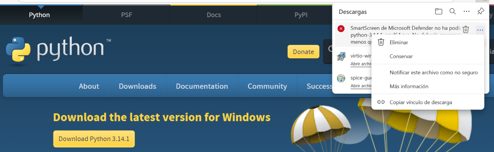
5. Run the installer and **enable the option “Add Python to PATH”** and press **Install now**.
   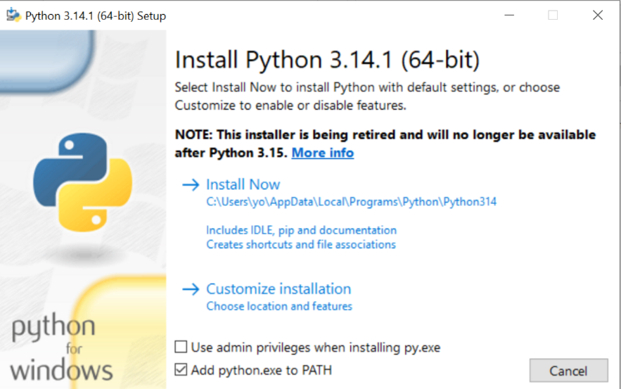
7. Complete the installation.
---

## 2. Open PowerShell

Open a **new PowerShell** window (no admin privileges required).

> **Tip:** Navigate to the folder where you want to work (e.g., `Documents`), then **hold the Shift key, right-> click**, and choose **“Open PowerShell window here”**. This ensures you start in the correct folder.

---

## 3. Install the required tools using `winget`

Use the following commands to install Git, ExifTool, and uv:

### **Install Git**
```powershell
winget install -e --id Git.Git
```
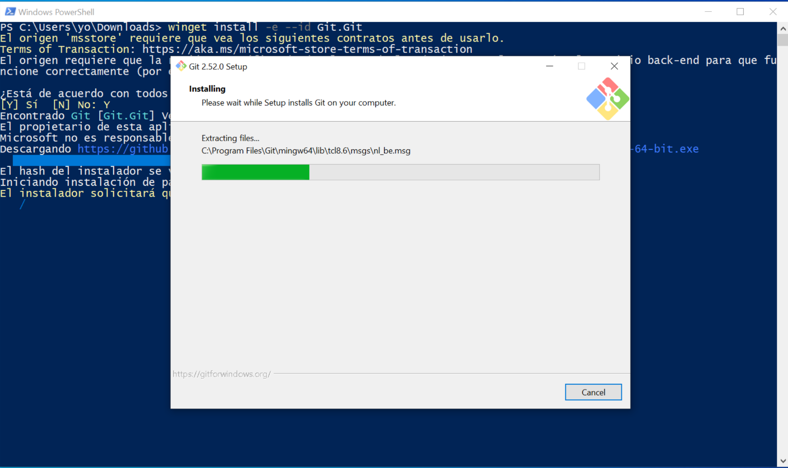

### Install ExifTool

```powershell
winget install -e --id OliverBetz.ExifTool
```
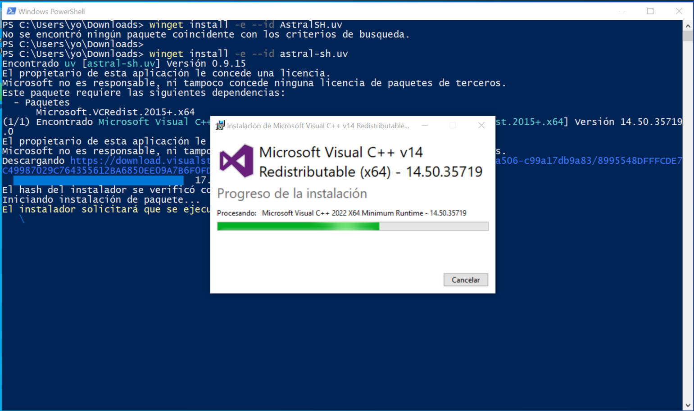

### Install uv

``` powershell
winget install -e --id astral-sh.uv
```
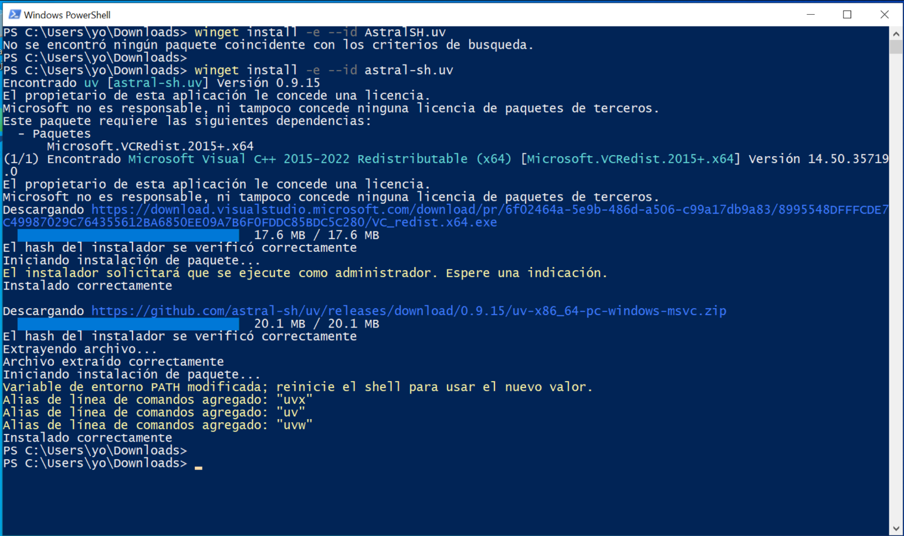

## 4. Update PATH environment variable and go to your Documents folder 

After installing the tools, close PowerShell completely. This ensures that PATH updates take effect. Then, open a new 
PowerShell session. and go to your Documents folder:

``` powershell
cd $HOME\Documents
```

## 5. Clone the wildintel-tools repository

To install **wildintel-tools**, you need to clone its repository from GitHub. Use the following command:

``` powershell
git clone https://github.com/ijfvianauhu/wildintel-tools.git
```
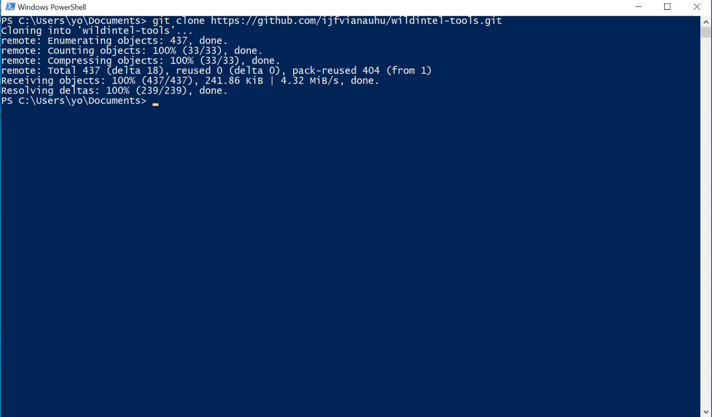

Once the cloning is complete, navigate into the newly created folder:

``` powershell
cd wildintel-tools
```
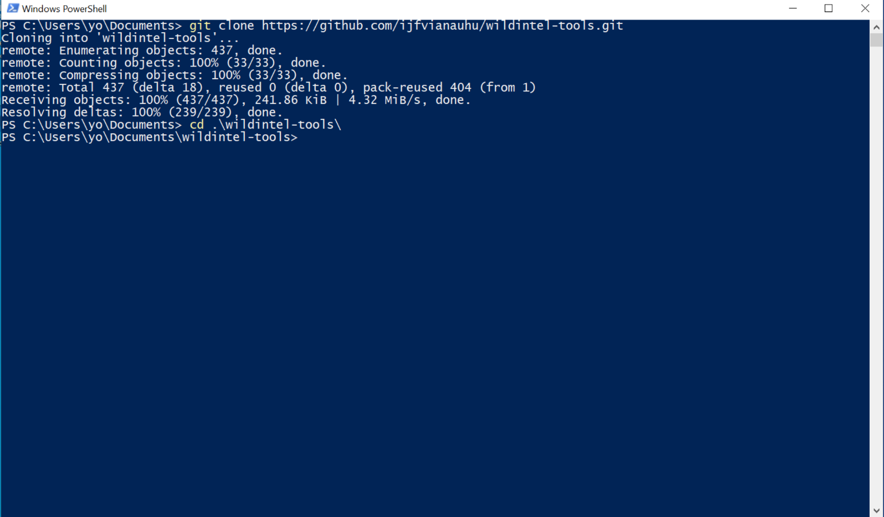


## 6. Checkout the correct version (v0.1.0)

Wildintel-tools is under active development, and new versions are released frequently. To ensure compatibility 
and stability, it is recommended to use version `v0.1.0`. Use the following command to switch to this version:

``` powershell
git checkout v0.1.0
```

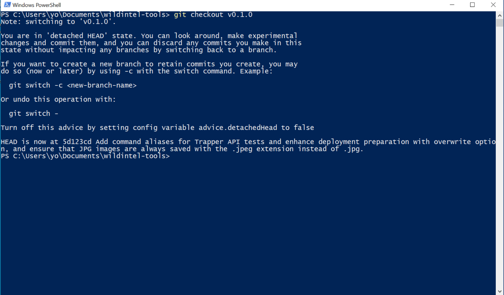

## 7. Run wildintel-tools using uv

``` powershell
uv run wildintel-tools --help
```

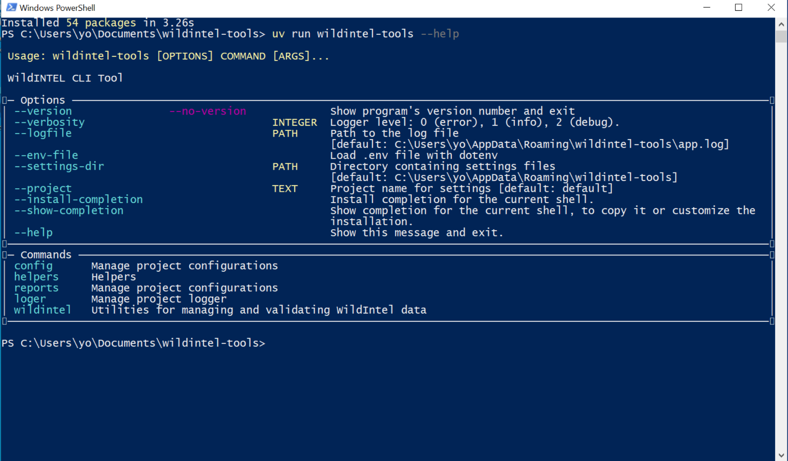

## 8. Configure connection with Trapper

1. View all available configuration options:

```
uv run wildintel-tools config show
```

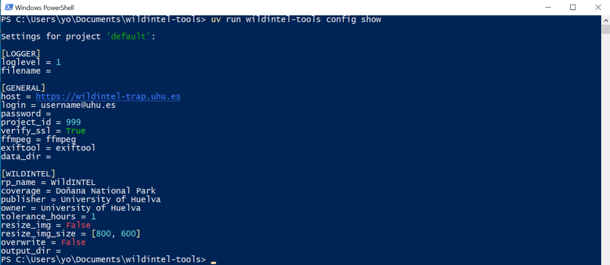


2. Set the Trapper login (username):

```
uv run wildintel-tools config set GENERAL.login your_username
```
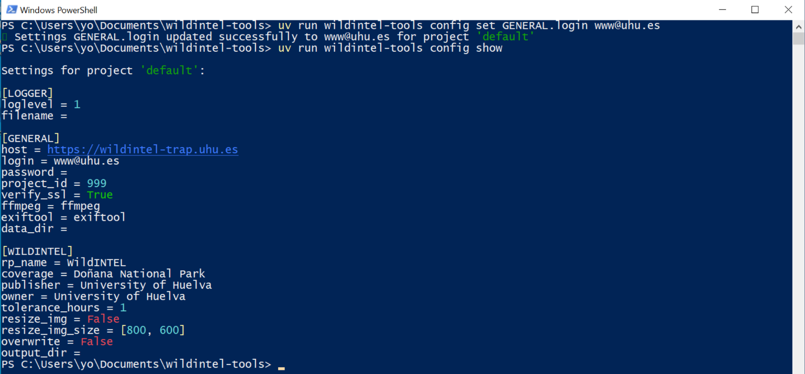

3. Set the Trapper password:

```
wildintel-tools config set GENERAL.password your_password
```

4. Test the connection to Trapper:

```
uv run wildintel-tools helpers test-connection
```

You should see a confirmation if the connection is successful.

## 9. Configure your working directories

To use **wildintel-tools** efficiently, you need to create a main directory, for example, in your **Documents** folder 
called **wildintel-data**. Inside this main directory, create the following subdirectories:

 * `collections/` – Store all your raw camera trap data here. Organize collections (e.g., recording sessions or revisions) as subfolders.
 * `collections-ready-to-trapper/`: this folder contains collection restructured into the format expected by trapper-tools. The contents of this directory are automatically generated by the wildintel-tools application after the validation and enrichment process.

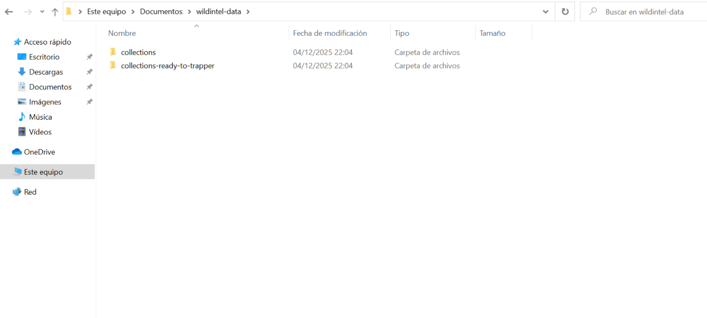

After creating the directories, you need to configure **wildintel-tools** to point to them. Execute the following 
command to set the collection directory:

```
uv run wildintel-tools config set GENERAL.data_dir $HOME\Documents\wildintel-data\collections
```

and to set the ready to trapper directory:

```
uv run wildintel-tools config set WILDINTEL.output_dir $HOME\Documents\wildintel-data\collections-ready-to-trapper\
```

Finally, check that changes have been applied:

```
uv run wildintel-tools config show
```

## 10. Organize collections

To prepare your camera trap data for processing, you need to organize your collections (revisions) in the `collections/` 
directory you created earlier. Each collection should be placed in its own subfolder within the `collections/` directory. 
For example, if you have two collections named `R0033` and `R0001`, your directory structure should look like this:

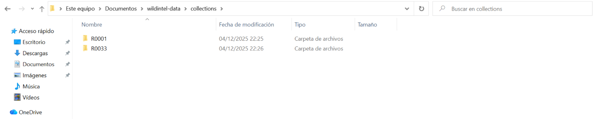

> ⚠️ Important note
> **Collection names** must start with the letter R followed by four digits. Examples: `R0001`, `R0234`, `R1025`.

Each collection folder should contain one or more subfolders for different camera trap deployments or locations. For example:
if you have a collection named `R0033` with two deployments, `r0033-wicp_0001` and `r0033-wicp_0001`, the structure 
should be as follows:

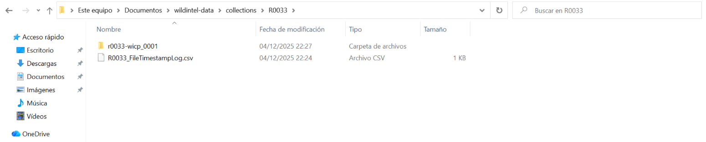

> ⚠️ Important note
> **Deployment names** must be the concatenation of the collection name and the location identifier, separated by a hyphen (-).

The second part of the deployment name (after the hyphen) is the location identifier, you can check the names of the
 locations create in Trapper executing the command:

```
uv run wildintel-tools helpers locations
```

Inside each deployment folder, place all the raw images and videos captured by the camera trap during that deployment:

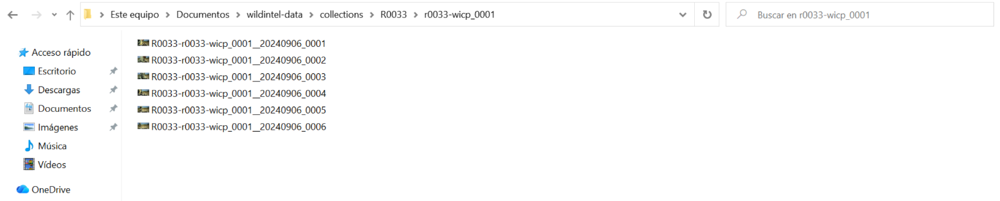

Finally, each collection folder must contain a csv file that includes metadata about the recording deployments. That is, 
for each deployment this file incluyes information about when deployment started and ended. The name of this file must be 
the collection name followed by `_FileTimestampLog.csv`.


Following our example, as collection `R0033` has two deployments, the metadata file should contain two entries. 

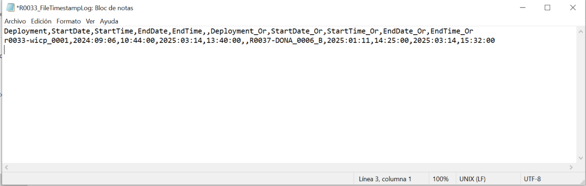

## 11. Validating collections

Before uploading your collections to Trapper, it is recommended to validate that collections and their deployments have
been organized correctly. You can check the structure of your collections:

```
uv run wildintel-tools wildintel check-collection 
```


You can check the structure of your deployments:

```
uv run wildintel-tools wildintel check-deployments 
```
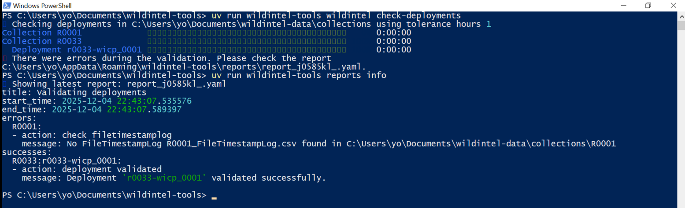

## 12. Preparing collections

Once your collections have been validated, you can proceed to prepare them for upload to Trapper. This process includes
enriching the metadata and restructuring the data into the format expected by Trapper. 

> ⚠️ Important note
> Enriching the metadata consists in attach XMP information into each image. You can customize this metadata changing
> the following configuration options: rp_name, coverage,  publisher, and owner.
> 

To prepare your collections, run the following command:

```
uv run wildintel-tools wildintel prepare-for-trapper 
```

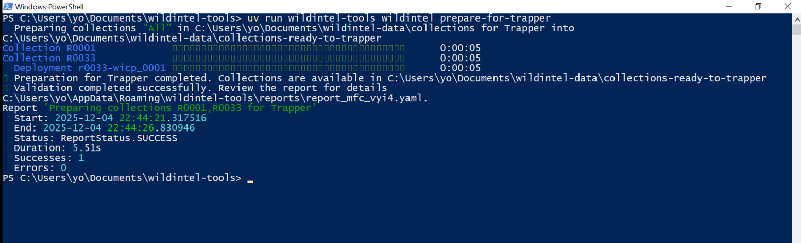

After the process is complete, the prepared collections will be available in the `collections-ready-to-trapper/` directory
you configured earlier.

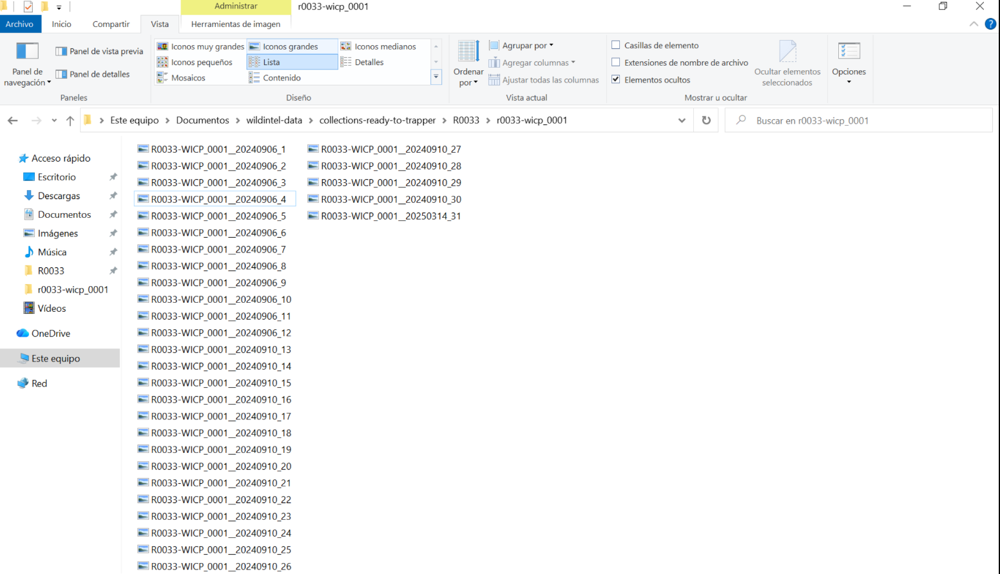


After all these steps, you are now ready to use `trapper-tools` to upload your prepared collections to Trapper!

